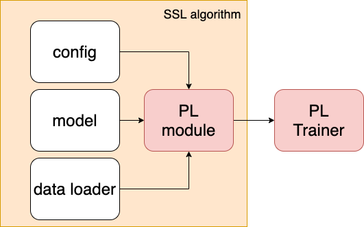

# Semi Supervised Learning with PyTorch Lightning

This project aims to use PyTorch Lightning to implement state-of-the-art algorithms in semi-supervised leanring (SSL).

## Semi-Supervised Learning
The semi-supervised learning is to leverage abundant unlabeled samples to improve models under the the scenario of scarce data. There are several assumptions which are usually used in semi-supervised learning,

* Smoothness assumption
* Low-density assumption
* Manifold assumption

Most of the approaches try to exploit regularization on models to satisfy the assumptions. In this repository, we will first focus on methods using consistency loss.

<!-- ***State of the art methods:*** <br/>
[Fixmatch](https://arxiv.org/pdf/2001.07685.pdf) <br/>
[NoisyStudent](https://arxiv.org/pdf/1911.04252.pdf) <br/> -->


## What is PyTorch Lightning
PyTorch Lightning is a PyTorch Wrapper to standardize the training and testing process of AI projects. The projects using PyTorch Lightning can focus on the implementation of the algorithm, and there is no need to worry about some complicated engineering parts, such as multi-GPU training, 16-bit precision, Tensorboard logging, and TPU training.

In this project, we leverage PyTorch Lightning as the coding backbone and implement algorithms with minimum changes. The necessary implementation of a new algorithm is put in `module`.

<!--Over the past few years, I usually spent lots of time reading non-core codes of every project. Although it's good to learn better coding logic/styles from other people, I hope I could get the critical points of every implementation faster. Therefore, I become a supporter of PyTorch Lightning and initiate this project with it.-->

## Requirements
```
pip install -r requirements.txt
```

## Module Flow
<p align="center">
  
</p>

* `configs`: Contained the config files for approaches.
* `models`: Contained all the models.
* `dataloader`: Data loader for every dataset.
* `module`: SSL modules inherited `pytorch_lightning.LightningModule`.

To implement a new method, one usually need to define new config, data loader and PL module.

## Usage

* Please refer to `argparser.py` for hyperparameters.
* `read_from_tb.py` is used to extract the final accuracies from `tensorboard` logs. 

### Fully-Supervised Training

```
python main.py -c configs/config_mixup.ini -g [GPU ID] --affix [FILE NAME]
```

### Train for Mixmatch

```
python main.py -c configs/config_mixmatch.ini -g [GPU ID] --num_labeled [NUMBER OF UNLABELED DATA] --affix [FILE NAME]
```

## Results

### Supervised Training
The result is the average of three runs (seed=1, 2, 3).

|                         | Acc       |
|   :---:                 |  :---:    |
| full train with mixup   | 4.41±0.03 |

### Mixmatch

The experiments run for five times (seed=1,2,3,4,5) in the paper, but only three times (seed=1,2,3) for this implementation.


|           | time (hr:min) | 250      | 500      | 1000    | 2000    | 4000    |
|     :---: | :---:         | :---:    | :---:    | :---:   | :---:   | :---:   |
| Paper     |               |11.08±0.87|9.65±0.94 |7.75±0.32|7.03±0.15|6.24±0.06|
| Reproduce |17:24          |10.93±1.20|9.72±0.63 |8.02±0.74| -       | -       |
| This repo |17:40          |11.10±1.00|10.05±0.45|8.00±0.42|7.13±0.13|6.22±0.08|


<!-- | This repo     |11.32±0.67|10.57±0.42|9.08±0.68|7.86±0.52|6.67±0.27|
| This repo(NoV)|12.12±0.62|9.84±0.69|8.30±0.40|7.34±0.22|6.57±0.14|
| NoV FS        |11.02±0.95|9.59±0.70|8.65±0.35|7.48±0.43|6.52±0.08|   
| This repo |      |11.28±1.15|10.27±0.14|8.55±0.14|7.55±0.24|6.40±0.03|  
| (Batch))) |17:40 |11.10±1.00|10.05±0.45|8.13±0.71|7.16±0.22|6.22±0.08|
| (Batch_2)))|17:40 |11.69±0.80|10.06±0.75|8.00±0.42|7.13±0.13|6.28±0.17| -->

## Plans 

1. Remixmatch
2. Fixmatch
3. GAN based method (DSGAN, BadGAN)
4. Other approach using consistency loss (VAT, mean teacher)
5. Polish the code for `CustomSemiDataset` in `data_loader/base_data.py`
